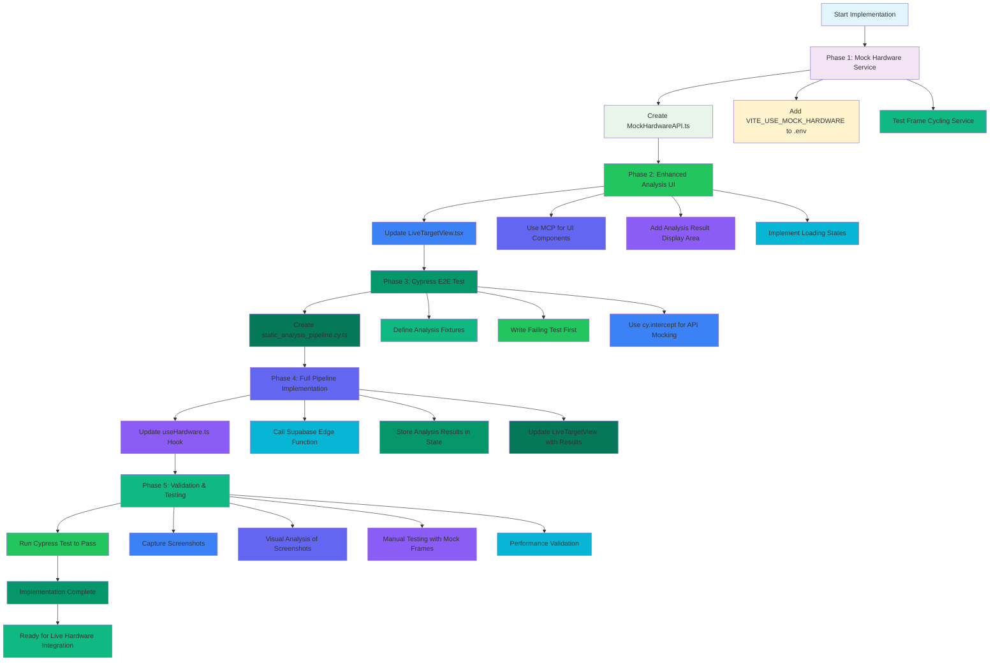
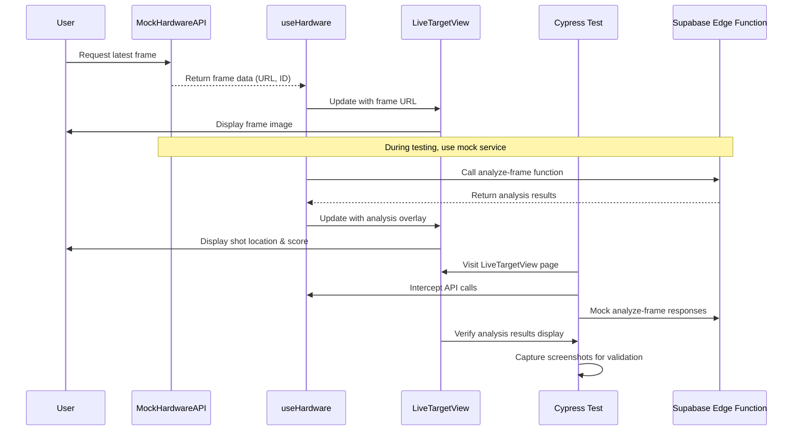

# GMShoot v2: Core Analysis Feature Workflow Diagram

## Implementation Workflow Overview

## Detailed Phase Breakdown

### Phase 1: Mock Hardware Service (Foundation)
**Goal**: Create test frame cycling service to enable development without live hardware

**Key Components**:
- `MockHardwareAPI.ts` - Service with `getLatestFrame()` function
- Environment variable `VITE_USE_MOCK_HARDWARE=true`
- Static frame counter cycling through 1-5
- Returns frame URLs and IDs for test frames

**Success Criteria**:
- ✅ Service cycles through all 5 test frames
- ✅ Frame URLs correctly formatted
- ✅ No dependency on external hardware
- ✅ Smooth transitions between frames

### Phase 2: Enhanced Analysis UI (User Interface)
**Goal**: Build modern UI components to display frames and analysis results

**Key Components**:
- Enhanced `LiveTargetView.tsx` component
- MCP-generated UI components for modern design
- Analysis result display area with overlay
- Loading states and error handling
- Responsive design for all screen sizes

**Success Criteria**:
- ✅ Displays test frames correctly
- ✅ Analysis overlay area visible
- ✅ Loading states work properly
- ✅ Responsive on mobile/desktop
- ✅ Accessibility compliance

### Phase 3: Cypress E2E Test (Test-Driven Development)
**Goal**: Create comprehensive test that initially fails, then passes after implementation

**Key Components**:
- `static_analysis_pipeline.cy.ts` test file
- Mock analysis data fixtures
- `cy.intercept()` for API mocking
- Test scenarios for all 5 frames
- End-to-end workflow validation

**Success Criteria**:
- ✅ Test initially fails (TDD approach)
- ✅ Test passes after implementation
- ✅ All 5 frames validated
- ✅ Analysis pipeline tested end-to-end
- ✅ Screenshots captured for validation

### Phase 4: Full Pipeline Implementation (Core Logic)
**Goal**: Implement complete analysis pipeline connecting UI to backend services

**Key Components**:
- Enhanced `useHardware.ts` hook with analysis calls
- Supabase Edge Function integration
- State management for analysis results
- Error handling and retry logic
- Performance optimization (<2 second target)

**Success Criteria**:
- ✅ Calls Supabase Edge Function for each frame
- ✅ Analysis results stored in state
- ✅ LiveTargetView displays real results
- ✅ Error handling works correctly
- ✅ Performance requirements met

### Phase 5: Validation & Testing (Quality Assurance)
**Goal**: Comprehensive validation of implemented analysis pipeline

**Key Components**:
- Passing Cypress test execution
- Screenshot capture and analysis
- Manual testing with mock frames
- Performance benchmarking
- Cross-browser compatibility testing

**Success Criteria**:
- ✅ Cypress test passes completely
- ✅ Screenshots show correct behavior
- ✅ All 5 frames analyzed successfully
- ✅ Analysis timing meets requirements
- ✅ Ready for live hardware integration

## Data Flow Architecture

## Test Frame Analysis

### Frame Coordinates and Expected Results

| Frame ID | Target Coordinates | Expected Score | Shot Location | Description |
|-----------|------------------|---------------|--------------|-------------|
| 1 | (320, 240) | 9.8 | Center | Perfect bullseye hit |
| 2 | (315, 245) | 8.5 | Upper-left | Slightly left and high |
| 3 | (340, 230) | 7.2 | Upper-right | Slightly right and high |
| 4 | (315, 255) | 6.9 | Lower-left | Slightly left and low |
| 5 | (335, 245) | 8.1 | Bottom-center | Slightly low and center |

## Implementation Timeline

### Phase 1: Mock Hardware Service (1-2 days)
- Day 1: Create MockHardwareAPI.ts service
- Day 2: Integrate with useHardware hook
- Test frame cycling functionality

### Phase 2: Enhanced Analysis UI (2-3 days)
- Day 3: Update LiveTargetView component
- Day 4: Generate MCP UI components
- Day 5: Implement analysis result display

### Phase 3: Cypress E2E Test (1-2 days)
- Day 6: Create static_analysis_pipeline.cy.ts
- Day 7: Write failing test with TDD approach
- Test and validate test structure

### Phase 4: Full Pipeline Implementation (3-4 days)
- Day 8: Implement analysis calls in useHardware
- Day 9: Update Supabase Edge Function
- Day 10: Connect UI to analysis results
- Day 11: Error handling and performance optimization

### Phase 5: Validation & Testing (1-2 days)
- Day 12: Run passing Cypress test
- Day 13: Capture and analyze screenshots
- Day 14: Manual testing and performance validation
- Day 15: Final documentation and deployment readiness

## Quality Gates

### Entry Criteria
- [ ] Mock service cycles through all 5 frames
- [ ] LiveTargetView displays frames correctly
- [ ] Cypress test created and failing initially
- [ ] Analysis pipeline implemented end-to-end
- [ ] All tests passing with screenshots
- [ ] Performance meets <2 second requirement

### Exit Criteria
- [ ] Complete analysis pipeline working
- [ ] All 5 test frames analyzed correctly
- [ ] Analysis results displayed with proper overlay
- [ ] Cypress test passes consistently
- [ ] Screenshots validate implementation
- [ ] Ready for live hardware integration

## Risk Mitigation

### Technical Risks
- **Mock Service Complexity**: Ensure frame cycling logic is robust
- **State Management**: Prevent race conditions in analysis calls
- **Performance**: Monitor analysis timing to meet <2 second goal
- **Test Reliability**: Ensure Cypress tests are stable and consistent

### Mitigation Strategies
- Implement comprehensive error handling in mock service
- Use React state management best practices
- Add performance monitoring and logging
- Create detailed test documentation
- Implement gradual rollout for live hardware integration

## Success Metrics

### Performance Targets
- **Frame Loading**: <500ms between frames
- **Analysis Time**: <2000ms from frame to result
- **UI Responsiveness**: <100ms for state updates
- **Test Coverage**: >90% for analysis pipeline code

### Quality Targets
- **Zero Defect Density**: No critical bugs in analysis pipeline
- **Test Reliability**: >95% consistent test results
- **Code Quality**: ESLint/Prettier compliance
- **Documentation**: Complete API and component documentation

## Conclusion

This workflow diagram provides a comprehensive, test-driven approach to implementing the core analysis feature of GMShoot v2. By following these phases systematically, the development team can create a robust, well-tested analysis pipeline that's ready for production deployment and live hardware integration.

The approach ensures:
- **Test-Driven Development**: Failing tests first, then implementation
- **Mock Services**: Enables development without hardware dependencies
- **Modern UI**: Leverages MCP for component generation
- **Comprehensive Testing**: Cypress E2E with visual validation
- **Performance Focus**: Meets <2 second analysis requirement
- **Quality Assurance**: Multiple validation checkpoints

Following this workflow will result in a fully functional analysis pipeline that's ready for the next phase of development and user testing.