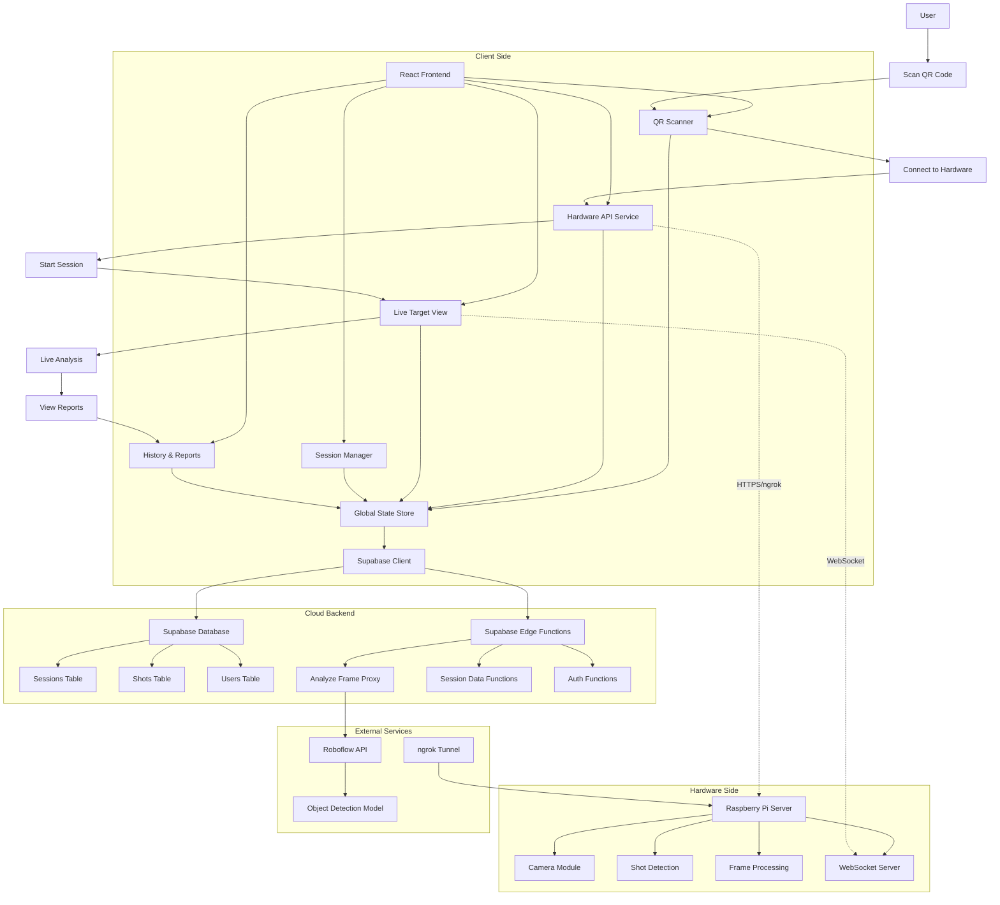
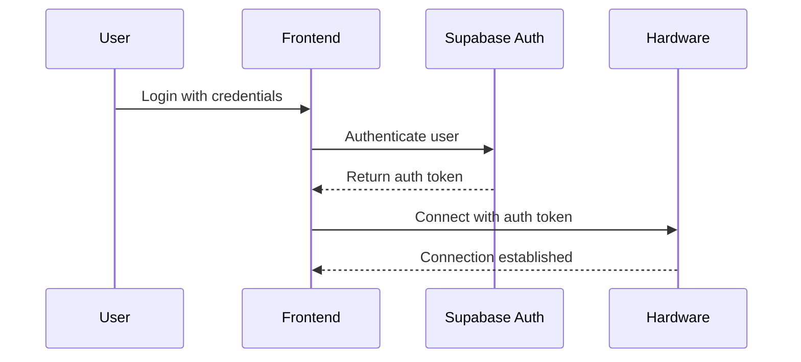
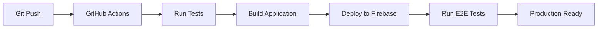

# GMShoot v2 System Architecture

## Overview

GMShoot v2 is a hardware-first shooting analysis platform that connects to Raspberry Pi devices via QR codes, provides real-time shot analysis using Roboflow AI, and manages shooting sessions with comprehensive reporting.

## System Architecture Diagram



## Component Architecture

### Frontend Components

#### Core Layout
```
AppLayout.tsx
├── Header (responsive, user info, navigation)
├── Main Content Area
└── MagicDock Navigation
```

#### Page Components
```
Pages/
├── LoginPage.tsx (MagicUI styling)
├── ConnectPage.tsx (QR scanning)
├── SessionPage.tsx (live view + controls)
├── HistoryPage.tsx (session list)
└── ReportPage.tsx (detailed analysis)
```

#### Feature Components
```
Components/
├── QRScanner.tsx (hardware connection)
├── LiveTargetView.tsx (real-time analysis)
├── SessionAnalyticsDashboard.tsx (real-time stats)
├── ReportVisualization.tsx (shot plotting)
└── HardwareStatusMonitor.tsx (connection status)
```

#### Services & Hooks
```
Services/
├── HardwareAPI.ts (device communication)
├── GeometricScoring.ts (shot analysis)
└── SequentialShotDetection.ts (pattern analysis)

Hooks/
├── useHardware.ts (device state)
├── useSession.ts (session management)
└── useAuth.tsx (authentication)
```

### Data Flow

#### Hardware Connection Flow
1. **QR Code Scan** → Parse GMShoot format → Extract ngrok URL
2. **Device Registration** → Authenticate with Pi server → Store connection
3. **Session Start** → Send configuration → Establish WebSocket
4. **Real-time Updates** → Frame polling → Analysis → Overlay display

#### Analysis Pipeline
1. **Frame Capture** → Pi server captures camera frame
2. **Shot Detection** → Local algorithm detects potential shots
3. **Frame Analysis** → Send to Roboflow via Supabase proxy
4. **Result Processing** → Geometric scoring → Display overlay
5. **Data Storage** → Save to Supabase with session context

#### Session Management
1. **Session Creation** → Insert record in Supabase
2. **Shot Recording** → Each analysis creates shot record
3. **Session Completion** → Update end time, generate report
4. **Historical Access** → Query sessions, display reports

## Technology Stack

### Frontend
- **React 19** with TypeScript
- **Vite** for build tooling
- **Tailwind CSS** for styling
- **MagicUI + shadcn/ui** for component library
- **React Router** for navigation
- **Zustand** for state management

### Backend
- **Supabase** (PostgreSQL) for database
- **Supabase Edge Functions** (Deno) for serverless logic
- **Roboflow API** for AI-powered shot detection
- **WebSocket** for real-time hardware communication

### Hardware
- **Raspberry Pi 4** as device server
- **Python** for device software
- **ngrok** for secure tunneling
- **Camera module** for frame capture

## Security Architecture

### Authentication Flow


### API Security
- **Supabase RLS** policies ensure data isolation
- **Edge Function proxy** hides Roboflow API keys
- **Hardware authentication** via signed tokens
- **ngrok tunneling** for secure device access

### Data Protection
- User data isolated by RLS policies
- API keys stored in Supabase secrets
- Hardware communication encrypted
- Session data backed up in real-time

## Performance Considerations

### Frontend Optimization
- **Lazy loading** for heavy components
- **React.memo** for expensive renders
- **Debounced polling** for hardware data
- **Efficient state updates** with proper selectors

### Backend Optimization
- **Database indexes** for common queries
- **RLS policy optimization** with cached auth.uid()
- **Edge Function caching** for repeated requests
- **WebSocket connections** for real-time updates

### Hardware Optimization
- **Frame compression** for efficient transmission
- **Local shot detection** to reduce API calls
- **Adaptive polling** based on activity
- **Connection pooling** for multiple clients

## Error Handling Strategy

### Client-Side Errors
- **Network failures** → Retry with exponential backoff
- **Hardware disconnection** → Clear UI indicators, reconnection attempts
- **Invalid QR codes** → User-friendly error messages
- **Analysis failures** → Graceful degradation, continue session

### Server-Side Errors
- **Edge Function timeouts** → Proper HTTP status codes
- **Database constraints** → Validation before insertion
- **Hardware communication** → Error logging, recovery procedures
- **External API failures** → Fallback responses, caching

## Testing Strategy

### Unit Testing
- Component isolation with React Testing Library
- Service mocking for hardware simulation
- Hook testing with custom renderers
- Utility function validation

### Integration Testing
- API service integration with mocked hardware
- Database operations with test fixtures
- Authentication flow end-to-end
- State management consistency

### End-to-End Testing
- **Cypress** for full user workflows
- Hardware simulation with cy.intercept()
- Cross-browser compatibility testing
- Mobile responsiveness validation

## Deployment Architecture

### Development Environment
```
Local Development
├── Frontend: Vite dev server (localhost:3000)
├── Supabase: Local stack (Docker)
├── Hardware: Pi server on network
└── Testing: Cypress test runner
```

### Production Environment
```
Production Deployment
├── Frontend: Firebase Hosting
├── Backend: Supabase (managed)
├── Functions: Supabase Edge Functions
├── Database: Supabase PostgreSQL
└── Monitoring: Firebase Analytics
```

### CI/CD Pipeline


## Monitoring & Observability

### Frontend Monitoring
- **React Error Boundaries** for crash reporting
- **Performance metrics** with Web Vitals
- **User interaction tracking** for analytics
- **Console error aggregation**

### Backend Monitoring
- **Supabase logs** for function execution
- **Database performance** metrics
- **API response times** and error rates
- **Hardware connectivity** status tracking

### Hardware Monitoring
- **Device health checks** via heartbeat
- **Resource usage** monitoring
- **Network stability** tracking
- **Error reporting** to central system

## Scalability Considerations

### Horizontal Scaling
- **Stateless Edge Functions** for auto-scaling
- **Database read replicas** for query distribution
- **CDN distribution** for static assets
- **Load balancing** for hardware connections

### Data Growth
- **Archive strategy** for old sessions
- **Data compression** for storage efficiency
- **Index optimization** for query performance
- **Purging policies** for cleanup

This architecture provides a robust, secure, and scalable foundation for the GMShoot v2 hardware-first analysis pipeline, ensuring excellent user experience while maintaining system reliability and performance.