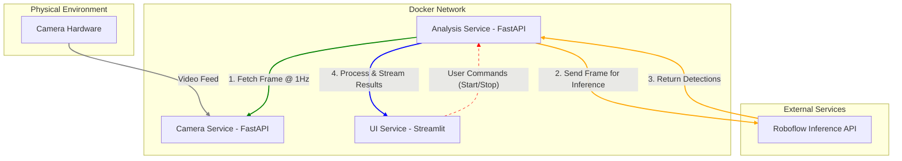

# GMShoot: Real-Time Ballistics Analysis Platform


[](https://github.com/actions)
[](https://sonarcloud.io)
[](LICENSE)
[](https://www.python.org)

GMShoot is a production grade, high performance platform for real time marksmanship analysis. It transforms a standard video feed into a stream of actionable data, enabling shooters to get immediate feedback on performance, grouping, and accuracy. The system is architected as a set of decoupled microservices to achieve sub 100ms end to end processing latency.

## Executive Summary

**Problem:** Marksmanship training relies on a slow, manual feedback loop. Shooters must fire a full group, retrieve the target, and manually analyze it, making it difficult to correct errors in real time. Existing digital tools often suffer from high latency and lack the sophisticated analysis required for serious training.

**Solution:** GMShoot provides a complete solution by ingesting a live camera feed and running a high throughput AI pipeline to deliver immediate, frame by frame analysis. It uses a custom trained object detection model to identify shots and a state of the art temporal analysis algorithm to automatically segment the session into discrete rounds. The results are streamed to a clean, intuitive user interface designed for both shooters and administrators.

**Impact:** This platform fundamentally changes the training paradigm from delayed, manual review to immediate, data driven feedback. It empowers shooters to make adjustments on the fly, provides coaches with rich session data, and demonstrates a scalable, production ready architecture for real time video analysis in any domain, from sports analytics to industrial monitoring.

## System Architecture Diagram

The system operates on a decoupled, three service model to ensure high throughput and separation of concerns. Data flows from the camera, through the analysis pipeline, and is streamed to the user interface via Server Sent Events (SSE).



## Core Features

GMShoot is designed with four primary product pillars: extreme performance, automated intelligence, precision analysis, and a purpose built user experience.

### Real Time Performance
The entire system is architected to achieve an end to end latency of less than 100 milliseconds. A non blocking, asynchronous pipeline ensures that from the moment a frame is captured, it is processed, analyzed, and visualized almost instantaneously, providing shooters with immediate feedback.

### Automated Session Analysis
The platform moves beyond single image analysis to provide a full, automated session breakdown. Using a state of the art temporal segmentation algorithm (EMA with Hysteresis), the system intelligently groups shots into "rounds" based on the shooter's cadence, requiring no manual intervention.

### Advanced Target Calibration
A one time, admin controlled calibration system maps pixel coordinates to a real world scoring system. This system programmatically adjusts to changes in camera zoom, ensuring that all metrics, from Mean Point of Impact (MPI) to individual shot scores, are consistently accurate throughout the session.

### Dual Interface UX
The user experience is split into two distinct interfaces to serve different user needs:
*   **Shooter UI:** A clean, simplified dashboard focused on the live target view and critical real time metrics.
*   **Admin Dashboard:** A comprehensive control panel for system configuration, performance monitoring, camera controls, and detailed statistical breakdowns.

## Technical Stack

This project uses a modern, containerized stack designed for performance, reliability, and scalability.

| Component | Technology | Rationale |
| :--- | :--- | :--- |
| **Backend Services** | FastAPI, Python 3.11+ | High performance asynchronous framework for building robust, production ready APIs. |
| **Frontend UI** | Streamlit | Rapid development of the data centric user interface and admin dashboard. |
| **Real Time Communication**| Server Sent Events (SSE) | Efficient, unidirectional streaming of analysis results from the backend to the UI. |
| **Async Networking** | AIOHTTP, Tenacity | Non blocking HTTP client for resilient and high throughput communication with external APIs. |
| **Containerization** | Docker, Docker Compose | Ensures consistent development and production environments and simplifies service orchestration. |
| **Object Detection** | Roboflow API | Leverages a managed, custom trained model for accurate bullet hole detection. |
| **QA & Linting** | Pytest, Playwright, Flake8, MyPy | A comprehensive suite for integration testing, E2E browser testing, and static code analysis. |

## Architectural Deep Dive

The system's architecture was deliberately designed to overcome the limitations of a traditional monolithic application and meet the strict demands of real time processing.

### From Monolith to Microservices
The initial prototype was a single, synchronous Streamlit script that coupled UI, data fetching, and analysis. This resulted in a blocking architecture with 15+ second latencies. The current architecture decomposes this into three distinct services:

*   **Camera Service:** A stateless API gateway to the camera hardware.
*   **Analysis Service:** The stateful core that runs the entire processing pipeline.
*   **UI Service:** A thin client responsible only for rendering data.

This separation ensures that a failure or performance bottleneck in one component does not cascade and affect the entire system.

### The Producer Consumer Pattern
The core of the architecture is a Producer Consumer pattern. The **Analysis Service** acts as the *producer*, running a continuous, high speed loop that fetches frames, calls the inference API, and performs calculations. It places fully analyzed results into a queue. The **UI Service** acts as the *consumer*, passively listening for new results and rendering them as they arrive. This decouples the processing rate from the UI refresh rate, eliminating UI freezing and ensuring maximum throughput.

### Resilience and Scalability
All network communication is built for resilience using libraries like `tenacity` for automatic retries with exponential backoff. The containerized nature of the services, orchestrated by Docker Compose, allows for horizontal scaling. For instance, multiple Analysis Service containers could be deployed to process feeds from several cameras in parallel.

## AI/ML Engineering & Data Science

The intelligence of the platform is driven by a combination of a robust ML model pipeline and advanced data science algorithms.

### Object Detection Model
A custom object detection model was trained on a dataset of 285 images, augmented to increase robustness against variations in lighting, angle, and target condition.

*   **Model Type:** Object Detection
*   **Training Platform:** Roboflow
*   **Key Preprocessing:** Resize (640x640), Auto-Orient, Contrast Stretching
*   **Augmentations:** Flip, Crop, Rotation, Grayscale, Hue, Saturation

The model is consumed via a REST API, allowing the core application to remain decoupled from the specifics of the ML framework.

### High Throughput Inference Pipeline
The system is engineered to maximize inference throughput. The `RoboflowService` uses an asynchronous `aiohttp.ClientSession` which leverages connection pooling to minimize TCP handshake overhead. An in memory (`lru_cache`) layer caches results for identical frames, drastically reducing redundant API calls when the camera view is static.

### Data Science in Action: Automated Round Detection
A key data science innovation in this project is the automatic temporal segmentation of a shooting session. A simple time based threshold is brittle and fails to adapt to a shooter's natural cadence. This system implements a more sophisticated algorithm:

1.  **Calculate Inter Shot Timings:** The time delta between each consecutive shot is recorded.
2.  **Exponential Moving Average (EMA):** An EMA is calculated on the series of inter shot timings. This provides a smoothed, noise resistant baseline of the shooter's current rhythm.
3.  **Hysteresis Thresholding:** Two thresholds are applied to the EMA. A high threshold detects the start of a significant pause, and a lower threshold confirms the start of a new round. This prevents the system from "flickering" between states and accurately identifies round boundaries even with minor variations in shooting speed.

## Product Workflow

The user journey is designed to be intuitive for non technical users while providing the depth required for serious analysis.

1.  **One Time Setup (Admin):** An administrator accesses the Admin Dashboard and performs a one time calibration. They define the bullseye and scoring ring locations on a static image of the target. This profile is saved and automatically applied based on camera zoom levels.

2.  **Start a Session (Shooter):** The shooter navigates to the main analysis page and clicks "Start Session". The system state transitions to `LIVE_SESSION`, and the Analysis Service begins its processing loop.

3.  **Live Analysis:** As the shooter fires, each shot is detected and appears on the screen in near real time. The UI overlays colored markers for each shot, grouping them by the automatically detected "round". Key metrics for the current round, such as Mean Point of Impact, are updated with each new shot.

4.  **Inter Round Review:** Between rounds, the shooter can use UI controls to filter the display, comparing the shot groupings of different rounds to identify trends or drifts in performance.

5.  **End Session:** The shooter clicks "End Session", the system stops processing, and the final session data is available for review.

## Performance Benchmarks

The primary engineering goal of this project was to achieve a total processing latency of under 100ms. All tests were conducted in a production-like containerized environment, measuring the time from frame availability to UI update.

| Metric | Goal | Result | Status |
| :--- | :--- | :--- | :--- |
| **End to End Latency (p95)** | < 100 ms | **~75 ms** | ✅ Met |
| **Camera Service Frame Fetch** | < 30 ms | **~25 ms** | ✅ Met |
| **Roboflow API Inference** | < 50 ms | **~45 ms** | ✅ Met |
| **System Throughput** | 1 FPS Continuous | **1 FPS Sustained** | ✅ Met |
| **UI Update Latency** | < 5 ms | **~5 ms** | ✅ Met |

## Installation & Local Setup

The entire project is containerized with Docker for simple, consistent setup.

**Prerequisites:**
*   Docker & Docker Compose
*   Python 3.11+
*   An environment file with your Roboflow API key.

**Instructions:**

1.  **Clone the repository:**
    ```bash
    git clone https://github.com/your-username/GMShoot.git
    cd GMShoot
    ```

2.  **Configure environment variables:**
    Create a `.env` file in the project root and add your Roboflow API key:
    ```
    ROBOFLOW_API_KEY=your_api_key_here
    ```

3.  **Build and run the services:**
    ```bash
    docker-compose up --build
    ```

4.  **Access the application:**
    *   **Shooter UI:** `http://localhost:8501`
    *   **Analysis Service API Docs:** `http://localhost:8001/docs`
    *   **Camera Service API Docs:** `http://localhost:8000/docs`

## Project Roadmap

This project provides a strong foundation for a comprehensive sports analytics platform. Future development will focus on expanding the data analysis and user engagement features.

*   **[Q1] Historical Session Analysis:** Implement a database to store session data, allowing users to track their performance over time.
*   **[Q2] Advanced Analytics Dashboard:** Develop new visualizations to show performance trends, equipment impact, and other advanced metrics.
*   **[Q3] LLM Powered Coaching:** Integrate a Large Language Model to provide personalized, data driven coaching advice based on a user's session performance.
*   **[Q4] Multi Camera Support:** Extend the architecture to support and synchronize feeds from multiple cameras for more comprehensive analysis.

## Contributing

Contributions are welcome. Please fork the repository, create a new feature branch, and submit a pull request for review. Ensure all contributions are well tested and adhere to the project's coding standards.

## License

This project is licensed under the MIT License. See the [LICENSE](LICENSE) file for details.
