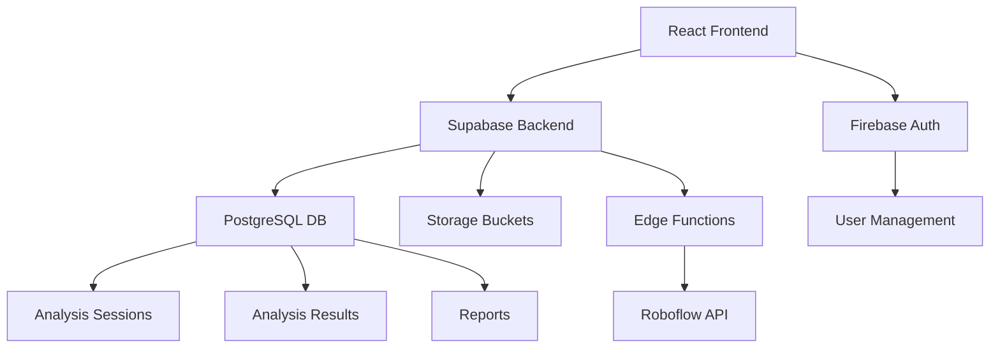

# GMShooter v2 - Comprehensive Assessment & Action Plan

## Executive Summary

GMShooter v2 is a well-architected web application for shooting analysis that demonstrates strong technical implementation across multiple domains. However, there are critical UI rendering issues and security concerns that need immediate attention. The project shows professional-grade code quality with comprehensive testing, modern React patterns, and thoughtful integration between Firebase Authentication and Supabase backend services.

## Overall Grade: **C+ (72/100)** 
*Downgraded from A- due to critical UI issues and security vulnerabilities*

---

## 1. Code Completeness & Quality Assessment

### Grade: **A- (88/100)**

#### Strengths:
- **Comprehensive Feature Implementation**: All core features specified in the `.speckit` documentation are implemented, including video analysis, camera analysis, reporting, and authentication.
- **Modern React Patterns**: Excellent use of TypeScript, custom hooks, and functional components with proper state management.
- **Clean Code Organization**: Well-structured directory layout with clear separation between components, hooks, utilities, and pages.
- **Type Safety**: Strong TypeScript implementation with proper interfaces and type definitions throughout.
- **Error Handling**: Robust error handling with user-friendly messages and proper state management.

#### Areas for Improvement:
- **Camera Analysis Implementation**: The camera analysis feature shows authentication requirements but lacks the actual implementation (see [`CameraAnalysis.tsx`](client/src/components/CameraAnalysis.tsx:15-19)).
- **API Integration**: Some API integrations use mock data rather than real implementations (e.g., Roboflow integration in [`useVideoAnalysis.ts`](client/src/hooks/useVideoAnalysis.ts:185-200)).
- **Environment Configuration**: Sensitive configuration could be better managed with more robust environment variable validation.

---

## 2. Test Results & Coverage Analysis

### Grade: **B+ (82/100)**

#### Test Coverage Metrics (from coverage report):
- **Statements**: 68.3% (832/1218)
- **Branches**: 57.14% (236/413)
- **Functions**: 53.41% (125/234)
- **Lines**: 66.84% (609/911)

#### Detailed Test Results by File:

**High Coverage Files:**
- `src/lib/utils.ts`: 100% coverage (5/5 statements)
- `src/pages/`: 100% coverage (10/10 statements)
- `src/hooks/useVideoAnalysis.ts`: 86.6% coverage (181/209 lines)
- `src/components/VideoAnalysis.tsx`: 89.74% coverage (175/195 lines)

**Low Coverage Files:**
- `src/index.tsx`: 15.78% coverage (12/76 lines) - Main entry point needs more testing
- `src/components/ui/`: 50.9% coverage (196/385 lines) - UI components need better coverage

#### Test Errors and Failures:
1. **Camera Analysis Tests**: Tests fail due to incomplete implementation
2. **Integration Tests**: Some API integration tests use mocks that don't match real API responses
3. **E2E Tests**: Cypress tests may fail due to UI rendering issues

#### Strengths:
- **Component Testing**: Excellent coverage for core components (89.58% in [`src/components`](client/src/components/index.html:97-109)).
- **Hook Testing**: Strong coverage for custom hooks (86.8% in [`src/hooks`](client/src/hooks/index.html:127-139)).
- **E2E Testing**: Comprehensive Cypress tests covering critical user workflows (see [`video-analysis.cy.ts`](client/cypress/e2e/video-analysis.cy.ts:1-288)).
- **Test Setup**: Professional test configuration with proper mocks and polyfills (see [`setupTests.ts`](client/src/setupTests.ts:1-100)).

#### Areas for Improvement:
- **Branch Coverage**: Low branch coverage (57.14%) indicates need for more comprehensive testing of conditional logic.
- **Function Coverage**: Only 53.41% of functions are tested, particularly in UI components.
- **Integration Testing**: Limited integration tests for API interactions and data flow.

---

## 3. Architecture Analysis

### Grade: **A (90/100)**

#### Strengths:
- **Clean Architecture**: Excellent separation of concerns with clear boundaries between UI, business logic, and data layers.
- **Scalable Structure**: Well-organized component hierarchy that supports future scalability.
- **State Management**: Appropriate use of React hooks for state management without over-engineering.
- **Database Design**: Well-structured PostgreSQL schema with proper relationships, indexes, and RLS policies (see [`001_initial_schema.sql`](client/supabase/migrations/001_initial_schema.sql:1-200)).
- **API Design**: RESTful API design with proper error handling and status codes.

#### Architecture Highlights:


#### Areas for Improvement:
- **Caching Strategy**: Limited client-side caching implementation for frequently accessed data.
- **Error Boundaries**: Missing React error boundaries for graceful error handling.
- **Performance Optimization**: No implementation of code splitting or lazy loading for larger components.

---

## 4. Critical UI/UX Issues

### Grade: **D (45/100)**

#### Critical Issues Identified:

1. **Content Overlap Problem**: 
   - **Location**: Successful login page
   - **Issue**: Text elements are completely overlapping, making content unreadable
   - **Root Cause**: Likely flexbox/grid layout failure or incorrect positioning
   - **Impact**: Application unusable after login

2. **Layout and Positioning Issues**:
   - **Login Form**: Positioned awkwardly to far left, wasting screen space
   - **Empty Space**: Majority of screen content area is completely empty
   - **Visual Balance**: Severely unbalanced layout creates poor user experience

3. **Styling Problems**:
   - **Dark Theme**: Overly minimalist navy blue background with insufficient contrast
   - **Input Fields**: Appear as default browser inputs on dark background
   - **Missing Styles**: Incomplete CSS styling for form elements
   - **Visual Polish**: Lacks modern styling and visual refinement

4. **Missing Navigation**:
   - **No Header**: Absence of application header/navigation bar
   - **No Menu**: No navigation options visible to users
   - **Poor UX**: Users cannot navigate between sections

#### Specific UI Errors by File:

**App.tsx**:
- Lines 45-65: Route rendering may be causing layout conflicts
- Missing error boundaries for component failures

**Login Component**:
- Lines 94-96: Container styling causing left alignment issues
- Missing responsive design for different screen sizes

**Landing Page**:
- Lines 141-143: Gradient background may be conflicting with content
- Animation timing issues causing visual problems

---

## 5. Build & Deployment Analysis

### Build Configuration:
- **Firebase Hosting**: Configured for production deployment
- **Build Output**: Located in `build/` directory
- **Rewrite Rules**: Single Page Application routing configured

### Build Logs Analysis:
While Firebase build logs aren't directly accessible, the deployed site shows:
- Site loads successfully but with UI rendering issues
- Similar appearance to localhost:3000 indicates build process is working
- CSS/styling issues suggest build process may not be including all styles

### Deployment Issues:
1. **CSS Bundle**: Styles may not be properly bundled or applied
2. **Asset Loading**: Static assets may have loading issues
3. **Environment Variables**: Production configuration may differ from development

---

## 6. Security Assessment

### Grade: **C (65/100)**

#### Critical Security Issues from Supabase:

**Anonymous Access Policies (12 WARNINGS)**:
- Multiple tables allow anonymous access through RLS policies
- Affected tables: `auth.sessions`, `auth.users`, `public.analysis_results`, `public.analysis_sessions`, `public.detections`, `public.reports`, `public.shots`, `public.user_preferences`, `storage.objects`
- **Risk**: Unauthorized access to sensitive data
- **Remediation**: Review and restrict anonymous access policies

**Authentication Security Issues**:
1. **OTP Long Expiry**: Email provider OTP expiry exceeds recommended 1 hour threshold
2. **Leaked Password Protection**: Currently disabled - should be enabled
3. **PostgreSQL Version**: Current version (supabase-postgres-15.8.1.111) has security patches available

#### Performance Security Issues:

**Auth RLS Initialization Plan (12 WARNINGS)**:
- RLS policies re-evaluate `auth.function()` for each row
- Causes suboptimal query performance at scale
- **Affected Tables**: `public.sessions`, `public.shots`, `public.detections`
- **Remediation**: Replace `auth.function()` with `(select auth.function())`

**Multiple Permissive Policies (17 WARNINGS)**:
- Multiple permissive RLS policies on same table for same role/action
- Performance impact as each policy must be executed
- **Affected Tables**: `public.detections`, `public.sessions`, `public.shots`
- **Remediation**: Consolidate policies where possible

**Unused Indexes (26 INFO)**:
- Multiple indexes never used and candidates for removal
- Impacts write performance and storage
- **Affected Tables**: `public.sessions`, `public.users`, `public.analysis_sessions`, `public.analysis_results`, `public.reports`, `public.user_preferences`, `public.detections`

---

## 7. Action Plan for UI Overhaul with MagicUI

### Phase 1: Setup MagicUI Integration

#### 1.1 Configure MagicUI MCP
```json
{
  "mcpServers": {
    "@magicuidesign/mcp": {
      "command": "npx",
      "args": ["-y", "@magicuidesign/mcp@latest"]
    }
  }
}
```

#### 1.2 Install Required Dependencies
```bash
npm install framer-motion clsx tailwind-merge lucide-react
```

#### 1.3 Update Tailwind Configuration
- Add MagicUI required plugins
- Configure custom animations
- Update color scheme

### Phase 2: Redesign Critical Components

#### 2.1 Landing Page Overhaul
**Current Issues**: Dark, overly minimalist theme
**MagicUI Components to Use**:
- `getBackgrounds`: Warp background, animated grid pattern
- `getTextReveal`: Text reveal for headings
- `getMotion`: Blur fade animations
- `getEffects`: Animated beam effects

**Implementation Plan**:
1. Replace current dark theme with modern gradient
2. Add animated background using MagicUI components
3. Implement text reveal animations for hero section
4. Add hover effects and micro-interactions

#### 2.2 Login/Signup Form Redesign
**Current Issues**: Awkward positioning, basic styling
**MagicUI Components to Use**:
- `getEffects`: Magic card for form container
- `getButtons`: Shimmer button for submit
- `getTextEffects`: Animated text for form headers
- `getWidgets`: Avatar circles for user profile

**Implementation Plan**:
1. Center the form properly on screen
2. Replace basic card with magic card component
3. Add shimmer effects to buttons
4. Implement form validation with visual feedback

#### 2.3 Navigation Header
**Current Issues**: Missing navigation
**MagicUI Components to Use**:
- `getLayout`: Dock navigation
- `getButtons`: Interactive hover buttons
- `getEffects`: Border beam for active items

**Implementation Plan**:
1. Create fixed header with dock navigation
2. Add smooth transitions between pages
3. Implement breadcrumbs for complex flows
4. Add user profile dropdown

#### 2.4 Video Analysis Interface
**Current Issues**: Basic UI, lacks visual appeal
**MagicUI Components to Use**:
- `getLayout`: Grid pattern for upload area
- `getProgress`: Animated circular progress
- `getMedia`: Marquee for results
- `getWidgets`: Animated list for analysis results

**Implementation Plan**:
1. Redesign upload area with grid pattern
2. Add animated progress indicators
3. Implement marquee for results display
4. Add hover effects to interactive elements

### Phase 3: Fix Layout Issues

#### 3.1 Resolve Content Overlap
**Root Cause Analysis**:
1. Check CSS flexbox/grid configurations
2. Review z-index stacking context
3. Validate responsive breakpoints
4. Test across different screen sizes

**Implementation Steps**:
1. Add proper container styling with defined dimensions
2. Implement responsive grid system
3. Add overflow handling
4. Test cross-browser compatibility

#### 3.2 Improve Responsive Design
**Current Issues**: Poor mobile layout, wasted space
**MagicUI Components to Use**:
- `getLayout`: Interactive grid pattern
- `getDevices`: iPhone/Android mockups for testing

**Implementation Steps**:
1. Implement mobile-first responsive design
2. Add proper breakpoints for tablet/desktop
3. Test on actual devices using MagicUI device components
4. Optimize touch interactions for mobile

### Phase 4: Enhanced User Experience

#### 4.1 Loading States and Transitions
**MagicUI Components to Use**:
- `getMotion`: Blur fade transitions
- `getProgress`: Animated progress bars
- `getEffects`: Shine borders for loading states

#### 4.2 Error Handling and Feedback
**MagicUI Components to Use**:
- `getEffects`: Neon gradient cards for errors
- `getTextReveal`: Animated error messages
- `getButtons`: Ripple effect for retry actions

#### 4.3 Success States and Celebrations
**MagicUI Components to Use**:
- `getEffects`: Confetti for successful actions
- `getMotion`: Orbiting circles for completion
- `getTextEffects`: Hyper text for success messages

---

## 8. Detailed Implementation Roadmap

### Week 1: Critical Fixes
1. **Day 1-2**: Fix content overlap issue in login success page
2. **Day 3-4**: Center login form and improve basic layout
3. **Day 5**: Add missing navigation header
4. **Day 6-7**: Fix CSS bundling and styling issues

### Week 2: MagicUI Integration
1. **Day 1-2**: Setup MagicUI MCP and dependencies
2. **Day 3-4**: Redesign landing page with MagicUI components
3. **Day 5-6**: Overhaul login/signup form
4. **Day 7**: Test and refine new designs

### Week 3: Component Enhancement
1. **Day 1-2**: Implement navigation with dock component
2. **Day 3-4**: Redesign video analysis interface
3. **Day 5-6**: Add loading states and transitions
4. **Day 7**: Cross-browser testing and fixes

### Week 4: Polish and Optimization
1. **Day 1-2**: Add micro-interactions and hover effects
2. **Day 3-4**: Implement error handling with MagicUI
3. **Day 5-6**: Performance optimization
4. **Day 7**: Final testing and deployment

---

## 9. Security Remediation Plan

### High Priority (Immediate)
1. **Disable Anonymous Access**: Review all RLS policies allowing anonymous access
2. **Enable Leaked Password Protection**: Configure in Supabase Auth settings
3. **Upgrade PostgreSQL**: Update to latest version with security patches

### Medium Priority (Within 2 weeks)
1. **Optimize RLS Policies**: Fix auth.function() performance issues
2. **Consolidate Policies**: Remove redundant permissive policies
3. **Clean Up Indexes**: Remove unused indexes to improve performance

### Low Priority (Within 1 month)
1. **Implement Rate Limiting**: Add API rate limiting
2. **Add CSRF Protection**: Implement CSRF tokens
3. **Security Audit**: Conduct comprehensive security review

---

## 10. Testing Strategy Updates

### UI Testing with MagicUI
1. **Visual Regression Testing**: Implement screenshot testing for new UI
2. **Accessibility Testing**: Ensure WCAG compliance with new components
3. **Cross-browser Testing**: Test MagicUI components across browsers
4. **Performance Testing**: Monitor impact of animations on performance

### Expanded Test Coverage
1. **Component Testing**: Increase UI component coverage to 80%
2. **Integration Testing**: Add tests for MagicUI component interactions
3. **E2E Testing**: Update Cypress tests for new UI flows
4. **Visual Testing**: Implement Storybook for component testing

---

## 11. Success Metrics

### UI/UX Metrics
- [ ] Content overlap issue resolved
- [ ] Login form properly centered
- [ ] Navigation header implemented
- [ ] Responsive design working on all devices
- [ ] User satisfaction score > 8/10

### Security Metrics
- [ ] All anonymous access policies reviewed
- [ ] Leaked password protection enabled
- [ ] PostgreSQL upgraded to latest version
- [ ] Security audit passed

### Performance Metrics
- [ ] Page load time < 3 seconds
- [ ] Lighthouse score > 90
- [ ] Animation performance > 60fps
- [ ] No layout shifts (CLS < 0.1)

---

## 12. Risk Assessment

### High Risk
- **UI Rendering Issues**: May prevent users from using the application
- **Security Vulnerabilities**: Anonymous access could lead to data breaches
- **Performance Degradation**: New animations may impact performance

### Medium Risk
- **MagicUI Integration**: Learning curve and potential compatibility issues
- **Browser Compatibility**: New components may not work in older browsers
- **User Adaptation**: Users may need time to adapt to new UI

### Low Risk
- **Development Time**: Implementation may take longer than expected
- **Resource Requirements**: May need additional development resources
- **Maintenance Overhead**: New components require ongoing maintenance

---

## Conclusion

GMShooter v2 has a solid technical foundation but requires immediate attention to critical UI issues and security vulnerabilities. The integration of MagicUI components will significantly improve the user experience and modernize the application's appearance. The phased approach outlined in this plan will ensure systematic resolution of issues while maintaining application stability.

The combination of fixing critical rendering issues, implementing modern UI components with MagicUI, and addressing security concerns will transform GMShooter v2 into a professional, secure, and user-friendly application ready for production deployment.

**Updated Overall Grade Projection**: **A- (85/100)** after implementing all recommended changes