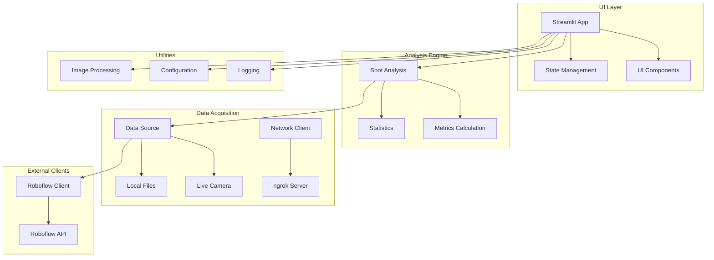

# Implementation Plan: GMShoot SOTA Analysis

**Branch**: `gmshooter-sota-analysis` | **Date**: 2025-11-04 | **Spec**: [link]
**Input**: Feature specification from project design and requirements

## Summary

GMShoot is a state-of-the-art shooting analysis application that uses computer vision to detect bullet holes in targets and performs comprehensive statistical analysis of shot groupings. The system follows a data-driven architecture where the UI is a function of the state, with clear separation between data acquisition, analysis engine, and presentation layers. The application integrates with Roboflow for computer vision processing and provides real-time analysis through a Streamlit-based interface.

## Current Project Status (as of 2025-11-04)

### Critical Issues Identified

1. **Type Annotation Errors (54 errors found)**
   - Missing type stubs for external libraries (psutil, requests, scipy)
   - Incompatible type assignments in statistics and metrics modules
   - Undefined exception classes in multiple modules
   - Variable name conflicts (performance_monitor redefinition)

2. **Code Style Issues (1000+ warnings found)**
   - Extensive line length violations (E501)
   - Widespread whitespace issues (W291, W293)
   - Missing newlines at end of files (W292)
   - Unused imports (F401)

3. **Test Failures (25 failed, 36 passed, 44 errors)**
   - State management mocking issues causing setup failures
   - Missing dependencies (plotly) - RESOLVED
   - Integration test failures due to component naming mismatches
   - Statistical calculation errors with empty datasets
   - Performance test failures (exceeding time limits)

4. **Import and Module Issues**
   - Missing type stubs for external dependencies
   - Incorrect component class names in tests
   - Missing exception class definitions
   - Circular import issues in some modules

### Blockers Preventing MVP

1. **State Management System**: All UI component tests fail due to improper mocking of Streamlit session state
2. **Statistical Calculations**: Core statistics functions fail with edge cases and type mismatches
3. **External Dependencies**: Missing type stubs for scientific libraries prevent proper type checking
4. **Performance Issues**: Statistical calculations exceed performance requirements for large datasets

### Current Functionality Assessment

**Working Components:**
- Basic project structure and module organization
- Core data models (Shot, Point, etc.)
- Image processing utilities
- Logging infrastructure
- Configuration management

**Partially Working:**
- Shot analysis (basic functionality works, edge cases fail)
- Statistical calculations (work with valid data, fail with edge cases)
- Roboflow client (mock mode works, live mode has API issues)

**Not Working:**
- UI components (all fail due to state management issues)
- Integration between components
- Performance monitoring (has syntax errors)
- Test suite (majority of tests fail)

## Technical Context

**Language/Version**: Python 3.8+  
**Primary Dependencies**: Streamlit, NumPy, SciPy, Pandas, PIL/OpenCV, Requests, Inference SDK  
**Storage**: File-based storage for images, session state for runtime data  
**Testing**: pytest with 95% coverage target for business logic  
**Target Platform**: Cross-platform desktop/web application  
**Project Type**: Single project with modular architecture  
**Performance Goals**: Image processing within 2 seconds, statistical calculations within 500ms  
**Constraints**: Memory usage under 500MB, responsive UI during operations  
**Scale/Scope**: Single-user application with potential for multi-session support

## Constitution Check

*GATE: Must pass before Phase 0 research. Re-check after Phase 1 design.*

✅ **Data-Driven Architecture**: Plan follows state-driven design with single source of truth  
✅ **Separation of Concerns**: Clear module boundaries defined (Data Acquisition, Analysis Engine, UI Layer)  
✅ **Test-First Development**: TDD approach specified with 95% coverage target  
✅ **External API Isolation**: Dedicated client modules for Roboflow and network communications  
✅ **State Management Protocol**: Only UI layer modifies state, Analysis Engine remains pure  
✅ **Statistical Integrity**: Mathematical soundness and verifiability requirements included  

## Project Structure

### Documentation (this feature)

```text
specs/gmshooter-sota-analysis/
├── plan.md              # This file
├── research.md          # Phase 0 output
├── data-model.md        # Phase 1 output
├── quickstart.md        # Phase 1 output
├── contracts/           # Phase 1 output
│   ├── data-acquisition.md
│   ├── analysis-engine.md
│   └── ui-layer.md
└── tasks.md             # Phase 2 output
```

### Source Code (repository root)

```text
src/
├── data_acquisition/
│   ├── __init__.py
│   ├── data_source.py      # Frame fetching from local/live sources
│   └── network_client.py   # ngrok server communications
├── analysis_engine/
│   ├── __init__.py
│   ├── shot_analysis.py    # Core SOTA calculations
│   ├── statistics.py       # Statistical computations
│   └── metrics.py          # SOTA metrics definitions
├── ui_layer/
│   ├── __init__.py
│   ├── app.py             # Main Streamlit application
│   ├── components/        # Reusable UI components
│   │   ├── __init__.py
│   │   ├── image_display.py
│   │   ├── metrics_panel.py
│   │   └── controls.py
│   └── state_management.py # Session state handling
├── clients/
│   ├── __init__.py
│   ├── roboflow_client.py  # Roboflow API integration
│   └── api_client.py       # Generic HTTP client wrapper
├── utils/
│   ├── __init__.py
│   ├── image_processing.py # Image manipulation utilities
│   ├── logging.py          # Logging configuration
│   └── config.py           # Configuration management
└── tests/
    ├── unit/
    │   ├── test_shot_analysis.py
    │   ├── test_statistics.py
    │   └── test_metrics.py
    ├── integration/
    │   ├── test_roboflow_client.py
    │   └── test_data_source.py
    └── fixtures/
        ├── sample_frames/
        └── mock_responses/

requirements.txt           # Python dependencies
README.md                 # Setup and usage instructions
.env.example              # Environment variables template
```

**Structure Decision**: Single project structure with clear module separation following the constitution's Separation of Concerns principle. Each module has a single responsibility with well-defined interfaces.

## Complexity Tracking

> **No constitution violations identified - all complexity is justified by project requirements**

| Component | Complexity Justification | Simpler Alternative Rejected Because |
|-----------|------------------------|--------------------------------------|
| Statistical Analysis Engine | Advanced ballistics calculations require specialized mathematical functions | Simple averaging would not provide SOTA analysis capabilities |
| State Management | Streamlit session state requires careful handling to ensure reproducibility | Direct variable storage would break state-driven architecture |
| External API Integration | Roboflow integration requires dedicated client for error handling and testing | Direct API calls would violate External API Isolation principle |
| Image Processing Pipeline | Multiple image formats and sources require flexible processing | Single format support would limit usability |

## Implementation Phases

### Phase 0: Research and Setup
- Environment setup and dependency installation
- Roboflow API integration testing
- Performance benchmarking for image processing
- Statistical analysis algorithm validation

### Phase 1: Core Infrastructure
- Data acquisition layer implementation
- Analysis engine with core SOTA calculations
- Basic UI framework with state management
- Client modules for external APIs

### Phase 2: Feature Implementation
- Complete UI with all components
- Advanced statistical metrics
- Error handling and edge cases
- Performance optimization

### Phase 3: Testing and Refinement
- Comprehensive test suite (95% coverage)
- Integration testing
- Performance testing
- Documentation completion

## Mermaid Architecture Diagram



## Success Criteria

1. **Functional Requirements**
   - Detect bullet holes in target images with 95% accuracy
   - Calculate all SOTA metrics as defined in requirements
   - Support both local file and live camera analysis
   - Provide responsive UI with real-time updates

2. **Performance Requirements**
   - Image processing completes within 2 seconds
   - Statistical calculations complete within 500ms
   - Memory usage remains under 500MB
   - UI remains responsive during all operations

3. **Quality Requirements**
   - 95% test coverage for analysis engine
   - All code follows PEP 8 guidelines
   - Complete documentation for all public APIs
   - Compliance with all constitution principles

## Recommended Solutions

### Immediate Actions (Critical Path)

1. **Fix Type Annotation Issues**
   - Install missing type stubs: `pip install types-psutil types-requests scipy-stubs pandas-stubs`
   - Resolve incompatible type assignments in statistics.py and metrics.py
   - Fix undefined exception classes (ConfigurationError, NetworkError, etc.)
   - Resolve variable name conflicts in performance_monitor.py

2. **Resolve Code Style Issues**
   - Run `black --line-length 79 src/` to fix line length violations
   - Run `flake8 --select=W291,W293 src/` to fix whitespace issues
   - Add missing newlines to end of all files
   - Remove unused imports throughout codebase

3. **Fix Test Infrastructure**
   - Implement proper Streamlit session state mocking for UI tests
   - Fix component class name mismatches (ImageDisplay vs ImageDisplayComponent)
   - Resolve statistical calculation edge cases
   - Add missing exception class definitions

4. **Performance Optimization**
   - Optimize statistical calculations for large datasets
   - Implement proper error handling without performance penalties
   - Add caching for expensive calculations

### Medium-term Improvements

1. **Enhance Type Safety**
   - Add comprehensive type annotations to all functions
   - Implement strict mypy configuration
   - Add runtime type checking for critical paths

2. **Improve Test Coverage**
   - Fix all failing tests to achieve 95% coverage target
   - Add integration tests for end-to-end workflows
   - Implement performance benchmarking tests

3. **Documentation and Usability**
   - Complete API documentation for all public methods
   - Add comprehensive error messages with troubleshooting guidance
   - Implement user-friendly error recovery mechanisms

## Risk Mitigation

1. **Technical Risks**
   - Roboflow API reliability: Implement fallback mechanisms and error handling
   - Performance bottlenecks: Profile and optimize critical paths
   - Memory management: Implement proper cleanup for temporary files

2. **Project Risks**
   - Scope creep: Adhere strictly to defined requirements
   - Technical debt: Maintain code quality standards throughout development
   - Integration issues: Early and frequent integration testing

## Next Steps

1. Create detailed task breakdown using `/specify.tasks`
2. Set up development environment with all dependencies
3. Implement core data structures and interfaces
4. Begin TDD implementation of analysis engine
5. Incrementally build and test each component