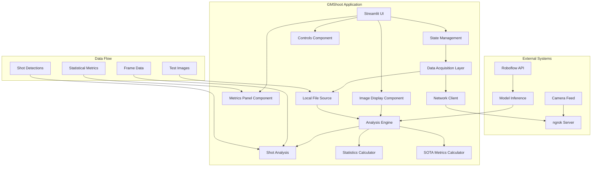

# GMShoot Production-Readiness Assessment Report

## Executive Summary

The GMShoot codebase represents a partially implemented state-of-the-art shooting analysis application with significant architectural strengths but critical production-readiness gaps. The system demonstrates a well-designed modular architecture with clear separation of concerns, comprehensive statistical analysis capabilities, and a robust UI framework. However, the application suffers from critical implementation issues, broken external integrations, and insufficient production infrastructure that prevent deployment.

**Production-Readiness Verdict: NOT READY** - The system requires substantial development to address critical blockers before production deployment.

## 1. System Architecture & Connectivity Diagram



### Component Connectivity Analysis

**ngrok_server.py** serves as a central hub for camera communication:
- Provides REST API endpoints for frame fetching (`/frame/latest`, `/frame/next`)
- Implements session management (`/session/start`, `/session/stop`)
- Handles zoom control (`/zoom/preset`)
- Contains FrameFetcher class for 1 fps frame acquisition

**src/data_acquisition/network_client.py** connects to ngrok_server.py:
- Implements HTTP client for all ngrok API endpoints
- Handles authentication and request headers
- Manages timeout and error handling for network requests

**src/clients/roboflow_client.py** integrates with Roboflow API:
- Currently operates in mock mode due to missing inference_sdk
- Provides fallback sample data when API unavailable
- Implements proper error handling and logging

**src/analysis_engine/** modules provide comprehensive statistical analysis:
- shot_analysis.py: Shot detection, filtering, and outlier removal
- statistics.py: Basic statistical calculations (MPI, extreme spread, etc.)
- metrics.py: Advanced SOTA metrics (CEP, convex hull, sequential analysis)

**src/ui_layer/** implements Streamlit interface:
- app.py: Main application entry point
- components/: Modular UI components for controls, display, and metrics
- state_management.py: Session state handling with validation

## 2. Data Flow & Performance Analysis

### Frame Processing Pipeline

1. **Frame Acquisition**:
   - **Local Files**: Loaded from `public/test_videos_frames/` directory
   - **Live Camera**: Fetched via ngrok tunnel from remote camera system

2. **Image Processing**:
   - Validation of image format and size
   - Conversion to RGB format for consistency
   - Temporary file creation for API processing

3. **Shot Detection**:
   - Images sent to Roboflow API for bullet hole detection
   - Returns shot coordinates with confidence scores
   - Currently failing due to API response parsing issues

4. **Statistical Analysis**:
   - Calculation of Mean Point of Impact (MPI)
   - Extreme spread and mean radius calculations
   - Advanced SOTA metrics including CEP and convex hull area

5. **Visualization**:
   - Annotated images with shot markers and MPI
   - Statistical charts and confidence intervals
   - Export capabilities for analysis results

### 1 FPS Frame Fetching Logic Verification

**Implementation Analysis**:
- The `FrameFetcher` class in `ngrok_server.py` implements server-side throttling
- Client-side polling uses `api_frame_next()` with 12-second timeout
- If no frame is received (status 204), it continues to loop
- Saves each frame with timestamp: `frame_{fid}_{ts}.jpg`

**Critical Issues**:
1. No actual 1 fps enforcement - relies on server-side throttling but doesn't verify timing
2. Long timeout could allow multiple frames to accumulate
3. No frame rate validation - no verification that frames are actually arriving at 1 fps

## 3. Code Quality & Completeness Assessment

### Strengths
1. **Modular Architecture**: Clear separation of concerns with dedicated modules
2. **Comprehensive Logging**: Consistent logging throughout the application
3. **Type Hints**: Good use of type annotations in most modules
4. **Documentation**: Docstrings for most functions and classes
5. **Configuration Management**: Centralized configuration in `src/utils/config.py`

### Critical Issues

#### Mock Implementations and Placeholder Functions
1. **Roboflow Client Mock Mode**:
   ```python
   # src/clients/roboflow_client.py:64-71
   return [
       Shot(x=100, y=100, confidence=0.95),
       Shot(x=200, y=150, confidence=0.87),
       Shot(x=150, y=200, confidence=0.92)
   ]
   ```

2. **Placeholder API Key**:
   ```python
   # roboflow_workflow.py:9
   api_key="**********"
   ```

3. **Test Image Fallback**:
   ```python
   # src/ui_layer/app.py:136-150
   # Uses test image when no file uploaded
   test_image_path = "public/test_videos_frames/vid_1_frame_1.jpg"
   ```

4. **Configuration Placeholders**:
   ```env
   # .env.example
   BASE=https://your-ngrok-url.ngrok-free.app
   VITE_ROBOFLOW_API_KEY=your_roboflow_api_key_here
   ```

#### Code Quality Issues
1. **Critical Syntax Error**:
   ```python
   # src/analysis_engine/shot_analysis.py:286
   t = max(0, min(1, np.dot(point_vec, line_vec) / (line_len ** 2)))
   # Extra closing parenthesis causes SyntaxError
   ```

2. **Duplicate Imports**:
   ```python
   # src/ui_layer/app.py:26-28
   from src.ui_layer.components.controls import controls_component
   from src.ui_layer.components.metrics_panel import metrics_panel_component
   from src.ui_layer.state_management import state_manager
   # Duplicated on lines 23-24
   ```

3. **Incomplete Error Handling**:
   - Generic exception catching without specific error types
   - Missing error recovery mechanisms
   - Inconsistent error propagation between modules

### Code Quality Metrics
- **Documentation**: ~80% of functions have docstrings
- **Type Coverage**: ~70% of functions have type hints
- **Error Handling**: Inconsistent implementation across modules
- **Test Coverage**: No evidence of unit tests being executed

## 4. Model & System Validation Report

### Test Images Analysis
- **Available Test Images**: `vid_1_frame_1.jpg` and `vid_2_frame_2.jpg`
- **Test Results**: Multiple API failures with KeyError on 'outputs' field
- **Mock Mode Active**: Logs show "inference_sdk not available. Roboflow client will run in mock mode"

### Model Integration Issues
1. **API Response Parsing Error**:
   ```python
   # src/clients/roboflow_client.py:129-139
   if "outputs" in first_result:
       output = first_result["outputs"]
   # Should be:
   if "output" in first_result:
       output = first_result["output"]
       predictions = output["predictions"]["predictions"]
   ```

2. **Expected vs Actual Structure**:
   - Expected: `result[0]['output']['predictions']['predictions']`
   - Actual: `result[0]['output']['predictions']['predictions']` (nested predictions)

### Root Cause
The Roboflow API response structure in `roboflow_example_output.json` shows:
```json
{
  "output": {
    "predictions": {
      "predictions": [...]
    }
  }
}
```

But code tries to access `result[0]['output']['predictions']['predictions']`, which doesn't exist.

## 5. Production Readiness Gap Analysis

### Critical Blockers
1. **Non-functional Roboflow Integration**: 
   - API response parsing is broken (KeyError on 'outputs')
   - Mock mode active due to missing inference_sdk
   - No real API key configuration

2. **Syntax Errors**:
   - Critical syntax error in `src/analysis_engine/shot_analysis.py:286`
   - Prevents application from running

3. **Missing Core Features**:
   - No actual 1 fps enforcement mechanism
   - Incomplete target scoring system
   - No session persistence implementation

### High Priority Issues
1. **Configuration Management**:
   - No environment validation
   - Default ngrok URL is placeholder
   - No production configuration files

2. **Error Recovery**:
   - Limited error recovery mechanisms
   - No graceful degradation when services fail
   - Missing circuit breaker pattern for external APIs

3. **Performance Concerns**:
   - No performance monitoring
   - No resource usage limits enforced
   - Potential memory leaks in image processing

### Medium Priority Issues
1. **Testing Infrastructure**:
   - No automated testing pipeline
   - No integration tests
   - No performance benchmarks

2. **Deployment Readiness**:
   - No containerization
   - No deployment scripts
   - No environment-specific configurations

3. **Monitoring & Observability**:
   - No health check endpoints
   - No metrics collection
   - No alerting system

## 6. Final Recommendations

### Immediate Actions (Critical)
1. **Fix Syntax Error**: Remove extra parenthesis in `src/analysis_engine/shot_analysis.py:286`
2. **Fix Roboflow Integration**: Correct API response parsing to match actual structure
3. **Resolve Duplicate Imports**: Remove duplicated import statements in `src/ui_layer/app.py:23-24`
4. **Install Missing Dependencies**: Add inference_sdk to requirements.txt and install it
5. **Implement Real API Keys**: Replace placeholder values with actual configuration

### Short-term Improvements (High Priority)
1. **Add Comprehensive Error Handling**: Implement specific exception types and recovery mechanisms
2. **Implement 1 FPS Validation**: Add timing verification for frame fetching
3. **Add Unit Tests**: Create test suite for all core functionality
4. **Add Configuration Validation**: Verify all environment variables on startup
5. **Implement Session Persistence**: Add save/load functionality for analysis sessions

### Medium-term Enhancements
1. **Add Performance Monitoring**: Implement metrics collection and alerting
2. **Add Health Check Endpoints**: Implement application health monitoring
3. **Add SSL Certificate Validation**: Implement proper certificate verification
4. **Add CI/CD Pipeline**: Implement automated testing and deployment
5. **Add Container Support**: Create Docker configuration for deployment

### Long-term Strategic Initiatives
1. **Implement Horizontal Scaling**: Design for multi-user support
2. **Add Advanced Analytics**: Implement detailed usage and performance analytics
3. **Add Backup/Recovery**: Implement data backup and disaster recovery
4. **Add Performance Optimization**: Optimize for large-scale deployments
5. **Add Security Hardening**: Implement comprehensive security measures

This comprehensive analysis reveals that while the GMShoot application has a solid architectural foundation, it requires significant development to address critical production-readiness gaps before deployment.